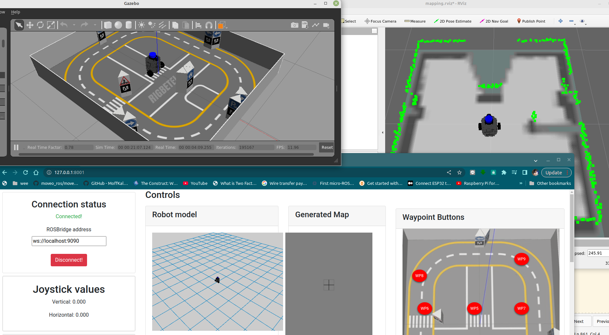
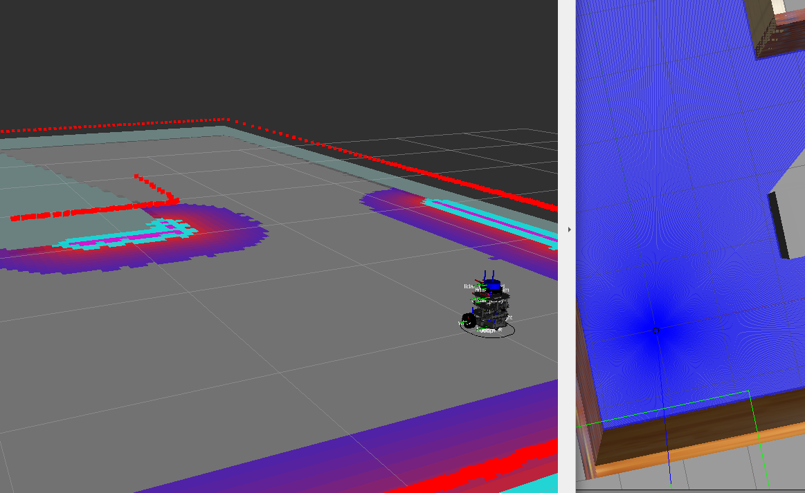
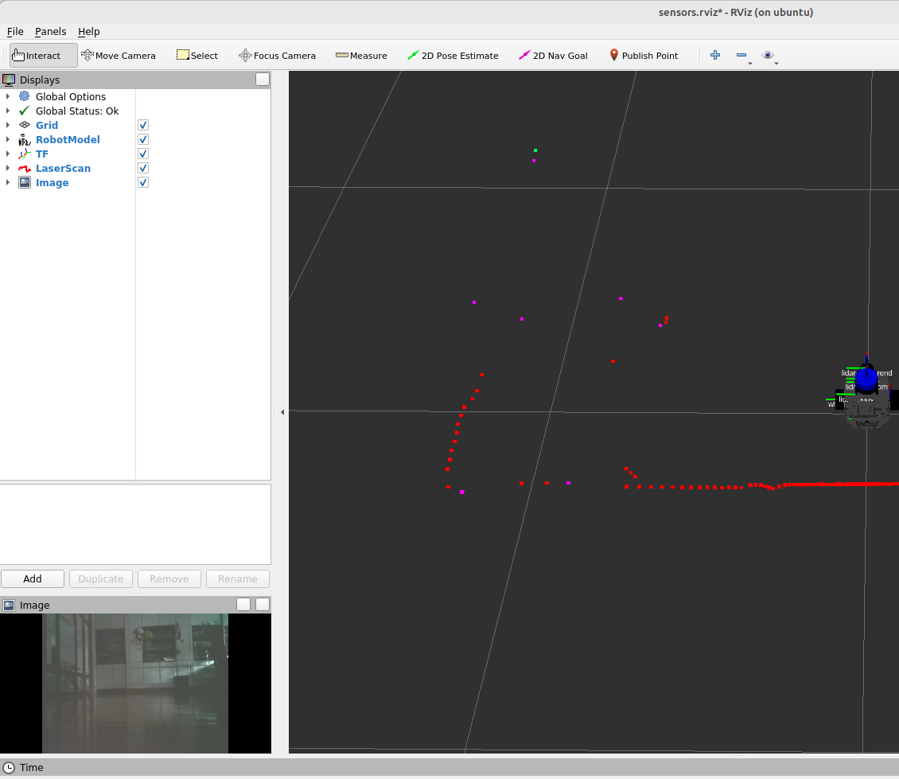
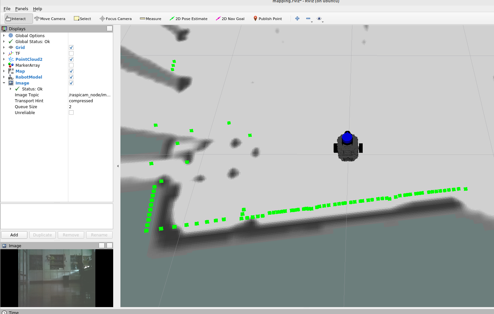
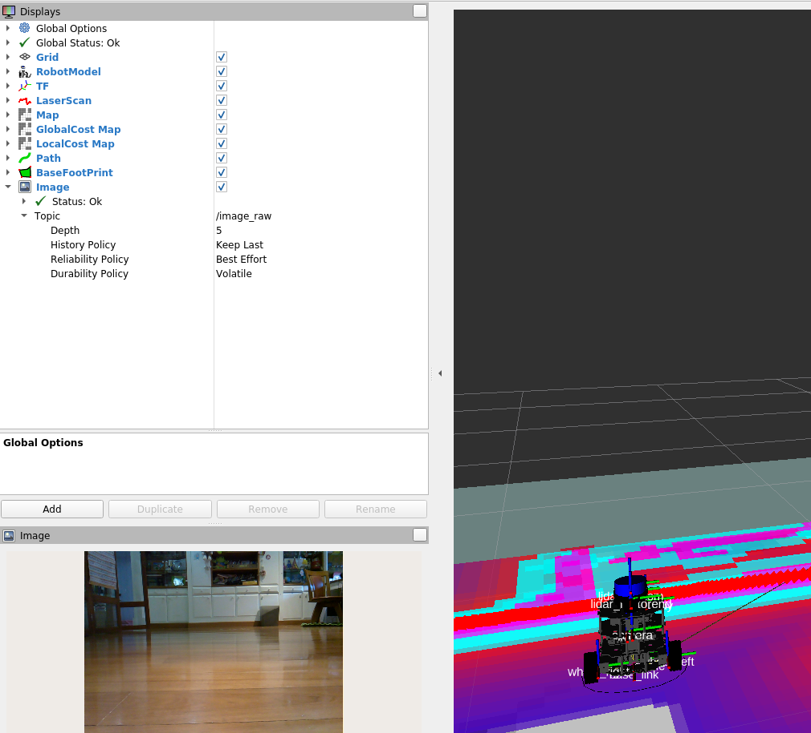

# Checkpoint 22: Tortoisebot on Docker

In this checkpoint, I need to do tortoisebot on docker, meaning that simulation or realrobot bring up on docker, slam on docker, waypoint on docker, and webapp on docker for ROS1, and ROS2
also I need to use docker-compose to do multiple launch of dockers in a single-shot.

## Quick Guide 

This quick guide assume that you have already installed docker, docker-compose, and related GPU drivers. If you follow this guide, and found problems, let me tell you one thing 
"it works on my machine" :D Hahaha  (A joke that docker users understand)

#### Task1 ROS1 simulation 

Terminal 1

```
docker context use default
xhost +local:root
```
cd to tortoisebot_ros1_docker,

```
cd tortoisebot_ros1_docker
docker-compose up
```

Terminal 2

```
webpage_address
```

Click on the https address that returns from CLI or open web browser and goto such an address returned from CLI

```
rosbridge_address
```

Copy and paste the returned sentence to the rosbridge address input box, in the web browser above. If there exist a previous sentence in the input box, delete all previous sentence, and paste new sentence to the rosbridge address input box, then place the green "connect" button.
if successful, the connection status changes from "not connected" to the word "connected", and the "connect" button changes to "disconnect" button.

If connection is successful, you should see the map buttons become colorful, and see the robot modes, and maps(may delay), and also the real time moving image captured by robot camera. You can place a "WP1" button or other "WP<number>" on the map, and see the robot is moving in such direction on the gazebo, and the moving image is also moving.


The expected result is shown in the pictures. There are 3 windows, 1 Gazebo, 1 Rviz with mapping, and 1 web browser




#### Task2 ROS2 simulation 

Terminal 1

```
docker context use default
xhost +local:root
```
cd to tortoisebot_ros1_docker,

```
cd tortoisebot_ros2_docker
docker-compose up
```

Terminal 2: teleopt to do the mapping

```
docker container ls
```

The result should be 

```
user:~$ sudo docker container ls
CONTAINER ID   IMAGE                                     COMMAND                  CREATED          STATUS         PORTS     NAMES
cf9ed9ec97cd   peerajakcp22/tortoisebot-ros2-slam:v1     "/ros_entrypoint.sh …"   11 minutes ago   Up 7 minutes             tortoisebot-ros2-slam
9f1ce4f5ef44   peerajakcp22/tortoisebot-ros2-gazebo:v1   "/ros_entrypoint.sh …"   11 minutes ago   Up 7 minutes             tortoisebot-ros2-gazebo
```

Choose ContainerID any of the two, either slam or gazebo

then

```
sudo docker exec -it cf9ed9ec97cd  bash
```

then inside the container prompt, do

```
ros2 run teleop_twist_keyboard teleop_twist_keyboard
```



#### Task3 ROS1 real robot

Terminal 1

1. copy file to real robot

```
scp docker-compose-ros1-real.yml tortoisebot@raspi_ipv4:/home/tortoisebot/Documents
```
where raspi_ip is the tortoisebot's ip


2. log on to your robot

```
ssh tortoisebot@aspi_ipv4
```

```
cd Documents/
```

```
docker-compose -f docker-compose-ros1-real.yml up
```

Now the Robot had turn on, to view RVIZ sensor you may decide to use your working machine as RVIZ  machine, or to use robot raspi as RVIZ machine
let me call this rviz_ip meaning RVIZ machine ip address. If you use robot raspi as RVIZ machine, don't forget to call 
```
noetic
```
so you may call rviz

On you RVIZ machine 

```
export ROS_MASTER_URI=http://raspi_ip:11311
export ROS_HOSTNAME=rviz_ip
```

Case 1, do sensor

```
roslaunch tortoisebot_slam view_sensors.launch
```
Case 2, do slam

```
roslaunch tortoisebot_slam tortoisebot_slam.launch
```

if you want to do teleopt while slam

```
docker exec -it <slam container_id> bash
```

this container id can be found using 

```
docker container ls
```
and choose one of the two, either tortoisebot-ros1-real-slam:v1, or real tortoisebot-ros1-real:v1

Once you arrive to the terminal of the same docker, the communication would not be set automatically, because the two environment variables are not yet set.
do

```
export ROS_MASTER_URI=http://raspi_ip:11311
export ROS_HOSTNAME=rviz_ip
source /tortoisebot_ws/devel/setup.bash
```
then I can communicate with all topics, thus do teleop

```
rosrun tortoisebot_control tortoisebot_teleop_key.py
```



If you did not get the same result, remember this works on my machine   
.
.
hahaha :D


### Task 4 Ros2 
```
ssh tortoisebot@aspi_ipv4
```

```
cd Documents/
```

```
docker-compose -f docker-compose-ros2-real.yml up
```

on RVIZ machine

```
galactic
export ROS_DOMAIN_ID=1
export CYCLONEDDS_URI=file:///var/lib/theconstruct.rrl/cyclonedds.xml
ros2 launch tortoisebot_description rviz.launch.py
```

in RVIZ
if you want to see the sensor
choose Displays->Global options->Fixed Frame=base_link 

if you want to see the costmap and do slam
choose Displays->Global options->Fixed Frame=map

If you want to do another terminal on the same docker to move the robot 

```
docker exec -it <slam container_id> bash
```

this container id can be found using 

```
docker container ls
```
and choose the one that is running slam

Once you arrive to the terminal of the same docker, the communication would not be set automatically, because the two environment variables are not yet set.
do

```
export ROS_DOMAIN_ID=1
export CYCLONEDDS_URI=file:///var/lib/theconstruct.rrl/cyclonedds.xml
source /ros2_ws/install/setup.bash
```

then I can communicate with all topics, thus do teleop

```
ros2 run teleop_twist_keyboard teleop_twist_keyboard 
```



## Docker Installation for NVIDIA graphic card user


After install the docker engine, use the command

```
sudo service docker start
docker context use default
```

Test Docker with Hello world image

```
sudo docker run hello-world
```
To make docker run on user without sudo

```
sudo groupadd docker
sudo usermod -aG docker $USER
sudo gpasswd -a $USER docker
newgrp docker
```

and log out from computer, and log in again

Test with docker hello world

```
docker run hello-world
```

### install Nvidia driver for docker

```
curl -fsSL https://nvidia.github.io/libnvidia-container/gpgkey | sudo gpg --dearmor -o /usr/share/keyrings/nvidia-container-toolkit-keyring.gpg \
  && curl -s -L https://nvidia.github.io/libnvidia-container/stable/deb/nvidia-container-toolkit.list | \
    sed 's#deb https://#deb [signed-by=/usr/share/keyrings/nvidia-container-toolkit-keyring.gpg] https://#g' | \
    sudo tee /etc/apt/sources.list.d/nvidia-container-toolkit.list
```

```
sudo sed -i -e '/experimental/ s/^#//g' /etc/apt/sources.list.d/nvidia-container-toolkit.list
```

```
sudo apt-get update
```

```
sudo apt-get install -y nvidia-container-toolkit
```

### Configure Nvidia driver for docker for X forward

Reference: 

https://docs.nvidia.com/datacenter/cloud-native/container-toolkit/latest/install-guide.html#installing-with-apt


```
sudo nvidia-ctk runtime configure --runtime=docker
sudo systemctl restart docker
nvidia-ctk runtime configure --runtime=docker --config=$HOME/.config/docker/daemon.json
systemctl --user restart docker
sudo nvidia-ctk config --set nvidia-container-cli.no-cgroups --in-place
```

Change The config file

```
sudo vi /etc/nvidia-container-runtime/config.toml
```
set no-cgroups to false
```
no-cgroups = false
```

Test The Nvidia driver for docker

```
sudo docker run --rm --runtime=nvidia --gpus all ubuntu nvidia-smi
```

If the sudo version works, try non-sudo version

```
docker run --rm --runtime=nvidia --gpus all ubuntu nvidia-smi
```

### Test X forward

```
mkdir gimp
cd gimp
```
Create a file name Dockerfile and write the following content.

```
FROM ubuntu
RUN apt-get update
RUN apt-get install -y gimp
CMD ["gimp"]
```

then build the docker

```
docker build . -t gimp:0.1
```

Test with Sudo version

```
xhost +local:root
sudo docker run --rm -it --name gimp -e DISPLAY=$DISPLAY -v /tmp/.X11-unix:/tmp/.X11-unix:ro --runtime=nvidia --gpus all gimp:0.1
```

Test with non-sudo version

```
xhost +local:root
docker run --rm -it --name gimp -e DISPLAY=$DISPLAY -v /tmp/.X11-unix:/tmp/.X11-unix:ro --runtime=nvidia --gpus all gimp:0.1
```
You should see GIMP drawing app appears on your linux screen.

## Task 1 

Inside simulation_ws/src, create a new folder named tortoisebot_ros1_docker.

- Create the following Docker images:

- tortoisebot-ros1-gazebo: This Docker image will contain everything necessaary for starting the Gazebo simulation.

- tortoisebot-ros1-slam: This Docker image will contain everything necessaary for starting the mapping system.

- tortoisebot-ros1-waypoints: This Docker image will contain everything necessaary for starting the waypoints action server.

- tortoisebot-ros1-webapp: This Docker image will contain everything necessaary for starting the Tortoisebot webapp.

- Create a Docker Compose file to start up all the previous containers. This Docker Compose file will start the following systems:

- TortoiseBot Gazebo simulation

- Mapping nodes

- Waypoints Action Server

- Tortoisebot Webapp


### Info on Tortoisebot

```
tortoisebot@ubuntu:~$ uname -a
Linux ubuntu 5.4.0-1118-raspi #130-Ubuntu SMP PREEMPT Tue Oct 1 19:40:28 UTC 2024 aarch64 aarch64 aarch64 GNU/Linux
tortoisebot@ubuntu:~$ lsb_release -a
No LSB modules are available.
Distributor ID:	Ubuntu
Description:	Ubuntu 20.04.6 LTS
Release:	20.04
Codename:	focal
tortoisebot@ubuntu:~$ uname -r
5.4.0-1118-raspi
```

### How to solve this checkpoint

1. Create a docker file similar to dockerfile_tb3, and launch gazebo simulation on docker on host
2. Create a docker file similar to move_and_turn, and launch action server
3. Create a docker file to launch web app
4. Use docker-compose to launch all dockers at the same time


### 1. Gazebo Docker file

1.1. Build the image 

Terminal 1

```
docker build -f dockerfile_ros1_tortoisebot_gazebo -t tortoisebot-ros1-gazebo:v1 .
```

1.2. Test Rviz, and tortoisebot Gazebo

Terminal 1

```
xhost +local:root
docker run -it -e DISPLAY=$DISPLAY -v /tmp/.X11-unix:/tmp/.X11-unix --gpus all tortoisebot-ros1-gazebo:v1 bash
```

   
    1.2.1 Test Rviz: inside docker run

```
    roscore &
    rviz
```

    1.2.2 Test tortoisebot gazebo: inside docker run

```
    roslaunch tortoisebot_gazebo tortoisebot_playground.launch
```

1.3 Test tortoisebot Gazebo with Sensor data in RVIZ

Terminal 1 Roscore and Gazebo

```
xhost +local:root
docker run -it -e DISPLAY=$DISPLAY -v /tmp/.X11-unix:/tmp/.X11-unix --gpus all --net=host peerajakcp22/tortoisebot-ros1-gazebo:v1 bash
```

Inside docker

```
    roslaunch tortoisebot_gazebo tortoisebot_playground.launch
```

Terminal 2 sensors

```
xhost +local:root
docker run -it -e DISPLAY=$DISPLAY -v /tmp/.X11-unix:/tmp/.X11-unix --gpus all --net=host peerajakcp22/tortoisebot-ros1-gazebo:v1 bash
```

Inside Docker

```
    roslaunch tortoisebot_slam view_sensors.launch
```

Terminal 3 Teleopt

```
xhost +local:root
docker run -it -e DISPLAY=$DISPLAY -v /tmp/.X11-unix:/tmp/.X11-unix --gpus all --net=host peerajakcp22/tortoisebot-ros1-gazebo:v1 bash
```

Inside Docker

```
    rosrun tortoisebot_control tortoisebot_teleop_key.py
```

1.4 Test tortoisebot Gazebo and slam

Terminal 1 Build the image

```
cp /etc/default/keyboard .
docker build -f dockerfile_ros1_tortoisebot_slam -t tortoisebot-ros1-slam:v1 .
```

Terminal 1 Roscore and Gazebo

```
xhost +local:root
docker run -it -e DISPLAY=$DISPLAY -v /tmp/.X11-unix:/tmp/.X11-unix --gpus all --net=host peerajakcp22/tortoisebot-ros1-gazebo:v1 bash
```

Inside docker

```
    roslaunch tortoisebot_gazebo tortoisebot_playground.launch
```

Terminal 2 Server

build the docker

```
cp /etc/default/keyboard .
docker build -f dockerfile_ros1_tortoisebot_slam -t tortoisebot-ros1-slam:v1 .
```

```
xhost +local:root
docker run -it -e DISPLAY=$DISPLAY -v /tmp/.X11-unix:/tmp/.X11-unix --gpus all --net=host peerajakcp22/tortoisebot-ros1-slam:v1 bash
```

Check Overlay workspace
```
rospack list | grep -e tortoisebot_ -e cartographer_ros
```

You should see packages whose name are tortoisebot and cartographer_ros

If the overlay was not successful, do

```
source /tortoisebot_ws/devel/setup.bash
source /tortoisebot_ws/carto_ws/devel_isolated/setup.bash
```

Inside Docker

```
    roslaunch tortoisebot_firmware server_bringup.launch
```

Terminal 3 Slam

```
xhost +local:root
docker run -it -e DISPLAY=$DISPLAY -v /tmp/.X11-unix:/tmp/.X11-unix --gpus all --net=host peerajakcp22/tortoisebot-ros1-slam:v1 bash
```

Inside Docker

```
    roslaunch tortoisebot_slam tortoisebot_slam.launch
```


## Web app

Terminal 1 Build the image

```
docker build -f dockerfile_ros1_tortoisebot_webapp -t peerajakcp22/tortoisebot-ros1-webapp:v1 .
```

then run the image

```
docker run --rm -it -p 8001:80 tortoisebot-ros1-webapp:v1 
```
-p host_port:container_port


### RUN full web control Robot

tar all the course_web_dev_ros content from the construct CP21, and place it under catkin_ws/src, and do catkin_make

Terminal 1 Playground

build (if required)

```
docker build -f dockerfile_ros1_tortoisebot_gazebo_playground -t tortoisebot-ros1-gazebo:playground .
```
run

```
docker run -it -e DISPLAY=$DISPLAY -v /tmp/.X11-unix:/tmp/.X11-unix --gpus all --net=host peerajakcp22/tortoisebot-ros1-gazebo:playground
```
Terminal 2 Rosbridge 

build (if required)

```
cd ~/catkin_ws
source devel/setup.bash
catkin_make
```

run

```
SLOT_ROSBRIDGE_PORT=9090 roslaunch course_web_dev_ros web.launch
```

or using docker

build (if required)
```
docker build -f dockerfile_ros1_tortoisebot_waypoint -t tortoisebot-ros1-waypoints:v1 .
```
run

```
docker run -it --net=host peerajakcp22/tortoisebot-ros1-waypoints:v1
```

Terminal 3 Server Bring-up

build (if required)

```
docker build -f dockerfile_ros1_tortoisebot_slam_serverbringup -t tortoisebot-ros1-slam:serverbringup .
```

run

```
docker run -it -e DISPLAY=$DISPLAY -v /tmp/.X11-unix:/tmp/.X11-unix --gpus all --net=host  tortoisebot-ros1-slam:serverbringup 
```


Terminal 4 Slam

build (if required)

```
docker build -f dockerfile_ros1_tortoisebot_slam_slam -t tortoisebot-ros1-slam:slam .
```

run

```
docker run -it -e DISPLAY=$DISPLAY -v /tmp/.X11-unix:/tmp/.X11-unix --gpus all --net=host  tortoisebot-ros1-slam:slam
```

Terminal 5 Action Server

build (if required)

```
cd ~/catkin_ws
source devel/setup.bash
catkin_make
```

run

```
cd ~/catkin_ws
source devel/setup.bash
rosrun course_web_dev_ros tortoisebot_action_server.py
```


```
cd ~/catkin_ws
source devel/setup.bash
roslaunch robot_gui_bridge websocket.launch
```

Terminal 6  Web server

run

```
cd tortoisebot_webapp
python -m http.server 8001
```

or docker

```
docker build -f dockerfile_ros1_tortoisebot_webapp -t tortoisebot-ros1-webapp:v1 .
```

and rungpu

```
docker run --rm -it -p 8001:80 tortoisebot-ros1-webapp:v1
```

Terminal 7 tf2_web server

```
roslaunch course_web_dev_ros tf2_web.launch
```

Open your web browser and goto http://localhost:8001


#### RUN full web control Robot with docker-compose

```
docker-compose up
```

Helper commands

```
cd ~/catkin_ws
source devel/setup.bash
rostopic pub -1 /cmd_vel geometry_msgs/Twist '{linear:  {x: -0.01, y: 0.0, z: 0.0}, angular: {x: 0.0,y: 0.0,z: 0.0}}'
```

theconstructsip web video address

```
https://<theconstructsip>/stream?topic=/camera/image_raw&width=400&height=300
```

My computer's web video address

```
http://127.0.0.1:11315/stream_viewer?topic=/raspicam_node/image
```

## Task 2


### Gazebo

build (if required)

```
cp /etc/default/keyboard .
docker build -f dockerfile_ros2_tortoisebot_gazebo -t tortoisebot-ros2-gazebo:v1 .
```

Terminal 1 Roscore and Gazebo

```
xhost +local:root
docker run -it -e DISPLAY=$DISPLAY -v /tmp/.X11-unix:/tmp/.X11-unix --gpus all --net=host tortoisebot-ros2-gazebo:v1 bash
```


### Slam

build (if required)

```
cp /etc/default/keyboard .
docker build -f dockerfile_ros2_tortoisebot_slam -t tortoisebot-ros2-slam:v1 .
```

Terminal 1 Roscore and Gazebo

```
xhost +local:root
docker run -it -e DISPLAY=$DISPLAY -v /tmp/.X11-unix:/tmp/.X11-unix --gpus all --net=host tortoisebot-ros2-slam:v1 bash
```


### Real Robot Ros1

the OS of the tortoisebot is

```
tortoisebot@ubuntu:~/ros1_ws/src/tortoisebot/raspicam_node/launch$ uname -a
Linux ubuntu 5.4.0-1119-raspi #131-Ubuntu SMP PREEMPT Thu Oct 10 17:28:35 UTC 2024 aarch64 aarch64 aarch64 GNU/Linux

tortoisebot@ubuntu:~$ cat /etc/lsb-release 
DISTRIB_ID=Ubuntu
DISTRIB_RELEASE=20.04
DISTRIB_CODENAME=focal
DISTRIB_DESCRIPTION="Ubuntu 20.04.6 LTS"
```

Therefore, we need to pull this docker image from docker hub

``
docker pull  --platform linux/arm64 arm64v8/ros:noetic-ros-core-focal
```

gpg2 --gen-key
This will generate a lot of info. but the important info is GPG KEY, which is a piece of code under pub topic control-c to copy the GPG-KEY
pass init <GPG-KEY>
docker login -u peerajakcp22
(venv) peerajak@peerajak-desktop-intel:~/MyRobotics/Checkpoint22/Checkpoint22_docker_ros/tortoisebot_ros1_docker$ docker tag tortoisebot-ros1-gazebo:v1 peerajakcp22/tortoisebot-ros1-gazebo:v1
(venv) peerajak@peerajak-desktop-intel:~/MyRobotics/Checkpoint22/Checkpoint22_docker_ros/tortoisebot_ros1_docker$ docker push peerajakcp22/tortoisebot-ros1-gazebo:v1
```

Open web browser and go to http://127.0.0.1:8001/


## Task3 Real Robot Ros1

Terminal 1
1. ssh to raspi 
```
ssh tortoisebot@192.168.3.4
```

2. inside Raspi prompt do

```
export ROS_MASTER_URI=http://raspi_ip:11311
export ROS_HOSTNAME=raspi_ip
```

where raspi_ip is the tortoisebot's ip, and rviz_ip is the ip, which RVIZ will be called.

3. docker-compose up

```
docker-compose -f docker-compose-ros1-real.yml up
```

Terminal 2, at RVIZ IP

1. 
```
export ROS_MASTER_URI=http://raspi_ip:11311
export ROS_HOSTNAME=rviz_ip
```
where raspi_ip is the tortoisebot's ip, and rviz_ip is the ip, which RVIZ will be called.


Case 1, do sensor

```
roslaunch tortoisebot_slam view_sensors.launch
```
Case 2, do slam

```
roslaunch tortoisebot_slam tortoisebot_slam.launch
```


building on PC the real robot slam docker. build for arm64v8

```
docker buildx build --platform linux/arm64 -f dockerfile_ros1_realrobot_tortoisebot_slam --push -t peerajakcp22/tortoisebot-ros1-real:v1 .
docker buildx build --platform linux/arm64 -f dockerfile_ros1_realrobot_tortoisebot_slam --push -t peerajakcp22/tortoisebot-ros1-slam-real:v1 .
docker run -it --net=host --privileged peerajakcp22/tortoisebot-ros1-slam-real:v1 
```

logon to realrobot, then pull the image, run, and call the bringup

```
ssh tortoisebot@192.168.3.4
docker pull peerajakcp22/tortoisebot-ros1-realrobot-slam:try1
docker run -it --net=host --privileged peerajakcp22/tortoisebot-ros1-realrobot-slam:try1 bash
# docker cp camerav2_410x308_30fps.launch  e6dbf17afd40:/tortoisebot_ws/src/tortoisebot/raspicam_node/launch # May be no need, as I should copy it beforehand
noetic && roslaunch tortoisebot_firmware bringup.launch

```

Then run server_bringup.launch 

```
ssh tortoisebot@192.168.3.4
roslaunch tortoisebot_firmware server_bringup.launch
```

Then in another terminal launch tortoisebot_slam.launch using:

```
ssh -X tortoisebot@192.168.3.4
roslaunch tortoisebot_slam tortoisebot_slam.launch
```

### Task 4 Ros2 Real robot

The difficulty of Ros2 real robot is that the communication between ROS2 real robot docker and the host (which in my case, the non-docker robot's raspi.).
We want to run rviz at the host, and bringup at the docker. If use net==host, I find the haphazard behavior where the topic does not show up.
For example, suppose I run a docker whose base is ros2-focal, and without setting the correct environment variable, then suppose I publish a topic, says /turtlebot1/cmd_vel,
normally if I go to a new terminal of the same docker, and do ros2 topic list, I should see a topic /turtlebot1/cmd_vel. But No. I see nothing except two default topics.
If net==host option was omitted when I call up the docker, then this problem does not happen.

The answer to this problem is to continue using net==host option, but setting 2 environment variables, and a file for docker to communicate with host.
1. ROS_DOMAIN_ID=0, or any integer (not too big, i guess)
2. CYCLONEDDS_URI=file:///var/lib/theconstruct.rrl/cyclonedds.xml, set both host and docker to be the same. 
3. copy the content of the file /var/lib/theconstruct.rrl/cyclonedds.xml from host to docker. To do so, sometime I don't have vi at the docker, can use here document syntax

```
cat <<EOF > filename
type what ever you want
here until end
when you end you write
EOF
```

Once all these 3 steps are done, I try

in docker

```
source /ros2_ws/install/setup.bash
ros2 launch tortoisebot_bringup autobringup.launch.py use_sim_time:=False exploration:=True
```

on host raspi

```
galactic
ros2 launch tortoisebot_description rviz.launch.py
```

If I see rviz not populate yet and looks like error on topic, please wait not longer than 1 min, everything should works properly.

If I want to do another terminal on the same docker to move the robot 

```
docker exec -it <container_id> bash
```

this container id can be found using 

```
docker container ls
```

Once I arrive to the terminal of the same docker, the communication would not be set automatically, because the two environment variables are not yet set.
do

```
export ROS_DOMAIN_ID=0
export CYCLONEDDS_URI=file:///var/lib/theconstruct.rrl/cyclonedds.xml
```

then I can communicate with /cmd_vel or whatever topic I want.

To build ROS2 real robot images

```
docker buildx build --platform linux/arm64 -f dockerfile_ros2_realrobot_tortoisebot --push -t peerajakcp22/tortoisebot-ros2-real:v1 .
docker buildx build --platform linux/arm64 -f dockerfile_ros2_realrobot_tortoisebot --push -t peerajakcp22/tortoisebot-ros2-real-slam:v1 .
```

Yes. the two images share the same docker file.


## Trouble shooting

if error like this

```
docker run --rm --runtime=nvidia --gpus all ubuntu nvidia-smi
```

and get error

```
docker: Cannot connect to the Docker daemon at unix:///home/peerajak/.docker/desktop/docker.sock. Is the docker daemon running?.
See 'docker run --help'.

```

```
export ROS_MASTER_URI=http://192.168.3.4:11311
export ROS_HOSTNAME=192.168.3.12
```

do

```
docker context use default
```


if error like this

```
Error response from daemon: could not select device driver "nvidia" with capabilities: [[gpu]]
```

do

```
docker context use default
```

if error like this

```
 [RenderEngine.cc:749] Can't open display: :0
```

do

```
xhost +local:root
```


Make a brighter image file /tortoisebot_ws/src/tortoisebot/raspicam_node/launch/camerav2_410x308_30fps.launch

```
<launch>
  <arg name="enable_raw" default="false"/>
  <arg name="enable_imv" default="false"/>
  <arg name="camera_id" default="0"/>
  <arg name="camera_frame_id" default="camera"/>
  <arg name="camera_name" default="camerav2_410x308"/>

  <node type="raspicam_node" pkg="raspicam_node" name="raspicam_node" output="screen">
    <param name="private_topics" value="true"/>
    <param name="brightness" value="90" /> 
    <param name="contrast" value="100" /> 
    <param name="sharpness" value="47" />
    <param name="saturation" value="1" />
    <param name="exposure_compensation" value="-10" />
    <param name="camera_frame_id" value="$(arg camera_frame_id)"/>
    <param name="enable_raw" value="$(arg enable_raw)"/>
    <param name="enable_imv" value="$(arg enable_imv)"/>
    <param name="camera_id" value="$(arg camera_id)"/>

    <param name="camera_info_url" value="package://raspicam_node/camera_info/camerav2_410x308.yaml"/>
    <param name="camera_name" value="$(arg camera_name)"/>
    <param name="width" value="410"/>
    <param name="height" value="308"/>

    <param name="framerate" value="30"/>
    <param name="exposure_mode" value="antishake"/>
    <param name="shutter_speed" value="0"/>
  </node>
</launch>
```

ROS 1 real robot, after compose up, got
```
tortoisebot-slam    | [ WARN] [1732443817.830965700]: W1124 10:23:37.000000    71 tf_bridge.cc:52] "base_link" passed to lookupTransform argument target_frame does not exist. 
tortoisebot-slam    | [ WARN] [1732443817.960545124]: W1124 10:23:37.000000    71 range_data_collator.cc:82] Dropped 1 earlier points.
tortoisebot-slam    | [ WARN] [1732443817.966402975]: W1124 10:23:37.000000    71 range_data_collator.cc:82] Dropped 1 earlier points.
```

This means that forgot to set ROS_MASTER_URI and ROS_HOSTNAME env variable

do

```
export ROS_MASTER_URI=http://raspi_ip:11311
export ROS_HOSTNAME=rviz_ip
```

if you see 

```
tortoisebot-gazebo           | No protocol specified
tortoisebot-gazebo           | No protocol specified
```

you need

```
xhost +local:root
```

